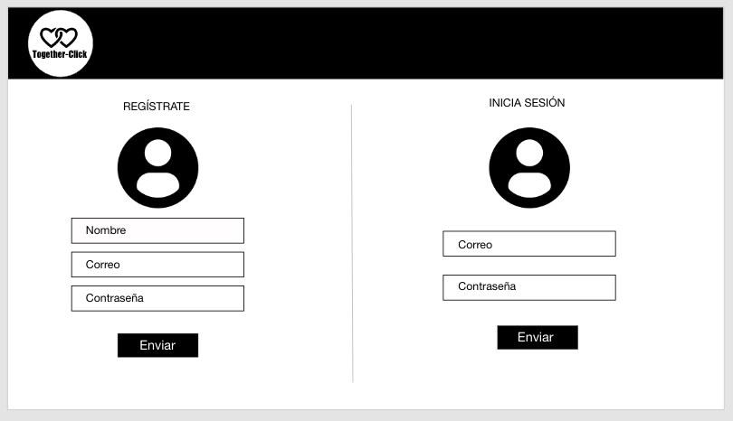

# TOGETHER-CLICK

El espacio incluyente donde toda la comunidad de bodas se conecta.

## Definición del producto

Planear una boda puede resultar muy complicado, quieres que sea perfecta, lo que siempre has soñado, pero a la vez que se ajuste a la realidad.

- ¿Por dónde comenzar a planearla?
- ¿A quién acudir para que nos aconseje?
- ¿Qué aspectos debemos considerar?
- ¿Jardín, playa, salón?
- ¿Ese grupo músical se sabe nuestra canción?

Es por eso que creamos **Together-Click**, un espacio donde todas aquellas personas interesadas en casarse se encuentren, se den apoyo, compartan dudas, ideas, consejos y puedan incluir a sus invitados. Además, ser una red que permita poner en contacto a las futuras novias y novios con potenciales proveedores de servicios de una manera casual y directa.

### Investigación

Cuando investigamos ideas similares a la nuestra, encontramos que:

- La información se encuentra diseminada en diferentes plataformas
- Las dudas son preguntadas en su mayoría en la sección de comentarios de blogs o revistas especializadas o videos de YouTube.
- Las webs especializadas (bodas.com.mx, zankyou.com.mx, bodissima) son más un directorio de proveedores que una red de apoyo.
- Existen eventos presenciales anuales donde se reúnen diferentes proveedores (Expotuboda, México Bridal Fashion), pero en los que es necesario contar con información previa para sacarles el mayor provecho.

Además estás plataformas tienen en común que están dirigidos principalmente a:

- las novias
- parejas heterosexuales

Consideramos que la industria de las bodas no se está adaptando del todo a los tiempos actuales, de mujeres enfocadas en su desarrollo profesional, hombres involucrados en su crecimiento personal y de familias diversas.

Nuestra propuesta es una red social donde **todos** los involucrados en una boda, puedan entrar en contacto, obtengan la información que necesitan interactuando entre ellos, y las novias y novios se sientan acompañados durante este arduo proceso y consigan la boda que sueñan.

Los usuarios principales del producto son:

- Novias
- Novios
- Padrinos
- Invitados
- Proveedores de servicios (agencias de viaje, cattering, desarrolladores web, entretenimiento, florerías, fotografía y video, invitaciones, joyerías, estilistas y maquillistas, músicos, pastelería y repostería, renta de mobiliario, tiendas departamentales, tiendas vestidos de novia y novio, salones, transporte, wedding planners, por mencionar solo algunos).

El problema que resuelve **Together-Click** es reunir información, servicios y usuarios de bodas en una sola plataforma con un enfoque plural e incluyente, en la cual puedan interactuar.

#### Potencial económico

De acuerdo con información del INEGI en 2017 se realizaron 528 678 matrimonios, y si bien es una tendencia que ya lleva muchos años a la baja (en el 2007 se registraron 595 209 matrimonios), expertos de la industria aseguran que ahora las personas se casan menos, pero gastan mucho más.

- La mayoría de las parejas profesionistas se casan a edades mayores, por lo que generalmente cuentan con más dinero disponible.
- Profesionalización de la industria (antes principalmente la novia y familiares organizaban la boda, hoy al contar con menos tiempo se acude a profesionales como wedding planners).
- Eventos personalizados, ahora es un conjunto de experiencias.

Según la CONDUSEF, en 2017, una boda sencilla para 100 invitados podía costar aproximadamente $ 110 000. La aplicación de citas formales SweetRing, realizó una encuesta entre sus usuarios mexicanos, y encontró que el 42% piensa que $ 300 000 sería un presupuesto realista para su boda. La revista FORBES México, señala que actualmente en la CDMX se gasta desde $ 1 200 por invitado. Estos costos pueden reducirse o aumentar dependiendo de la magnitud del evento y los servicios que la pareja escoja.

El mercado de las bodas tiene un gran potencial económico para los prestadores de servicios:

- Es un evento que la mayoría de las personas utilizará una vez en su vida, por lo que están dispuestas a invertir una cantidad de dinero considerable.
- La mayoría al no tener experiencia en dicho evento busca asesoría para acceder a las mejores opciones del mercado, de acuerdo con su presupuesto.
- La búsqueda de información sobre estos servicios a través de Internet, así como su contratación haciendo uso de plataformas web o aplicaciones móviles es una tendencia en crecimiento.

## Historias de usuario

### NOVIAS Y NOVIOS

- Crear una cuenta como NOVI@
- Loguear con Facebook y Gmail
- Si el mail o password no es válido, al momento de logearme, debo poder ver un mensaje de error.
- Debe ser visible si hay algún mensaje de error.
- Debo poder ver esta página de creación en Móviles y desktop (responsive).
- No debe necesitar recargar la página para crear una cuenta (SPA).

### PROVEEDORES

- Crear una cuenta como PROVEEDOR con correo y password
- Loguear con Facebook y Gmail
- Si el mail o password no es válido, al momento de logearme, debo poder ver un mensaje de error.
- Debe ser visible si hay algún mensaje de error.
- Debo poder ver esta página de creación en Móviles y desktop (responsive).
- No debe necesitar recargar la página para crear una cuenta (SPA).

### Sprint 1

1. Como nuevo usuario debo poder crear una cuenta nueva con email y password

    *Criterios de aceptación*

    - [ ] Si el mail o password no es válido, al momento de logearme, debo poder ver un mensaje de error.

    - [ ] Debe ser visible si hay algún mensaje de error.

    - [ ] Debo poder ver esta página de creación en móviles y desktop (responsive).

    - [ ] No debe necesitar recargar la página para crear una cuenta (SPA).

    *Definición de terminado*

    - [ ]  La funcionalidad cumple satisface los criterios de aceptación.

    - [ ] La funcionalidad tiene test unitarios.

    - [ ] El diseño visual corresponde al prototipo de alta fidelidad.

    - [ ]  El código de esta funcionalidad recibió code review.

    - [ ]  La funcionalidad esta desplegada y pública para ser probada.

    - [ ]  La funcionalidad fue probada manualmente.

    - [ ]  Se hicieron pruebas de usuabilidad y se implementó el feedback si se consideró necesario.

## Diseño de la Interfaz de Usuario

### Prototipo de alta fidelidad

El prototipo de alta fidelidad se diseñó en AdobeXD

#### Mobile


##### Desktop




## Boilerplate

```text
./
├── imagenes
├── src
│   ├── lib
│   │   └──index.js
│   ├── index.html
│   ├── main.js
│   └── style.css
├── test
│   └──index.spec.js
├── .babelrc
├── .eslintrc
├── .gitignore
├── README.md
└── package.json
```

## Referencias

[INEGI](https://www.inegi.org.mx/temas/nupcialidad/)

[Hay menos bodas, pero más trabajo, para los ‘wedding planners’ en México](https://www.forbes.com.mx/hay-menos-bodas-pero-mas-trabajo-para-los-wedding-planners-en-mexico/)

[¿Cuánto cuesta casarse?](https://www.condusef.gob.mx/Revista/index.php/presupuesto-familiar/presupuesto/762-cuanto-cuesta-casarse)

[¿Cuánto gastan los mexicanos en su boda?](https://blog.sweetring.com/article/boda-mexicanos/)

[¿Cuánto cuesta una boda en México?](https://www.dineroenimagen.com/actualidad/cuanto-cuesta-una-boda-en-mexico/110269#view-1)
