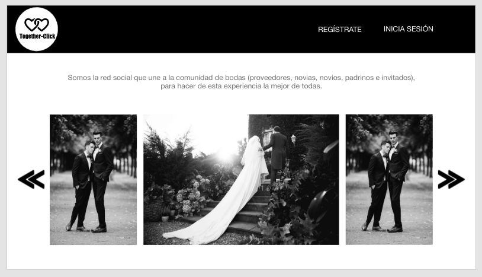

# TEMA: bodas 
# Nombre de la app: Together-Click

## Historias de usuario
### NOVIAS
- Crear una cuenta como NOVI@
- Loguear con Facebook y Gmail
- Si el mail o password no es válido, al momento de logearme, debo poder ver un mensaje de error.
- Debe ser visible si hay algún mensaje de error.
- Debo poder ver esta página de creación en Móviles y desktop (responsive).
- No debe necesitar recargar la página para crear una cuenta (SPA).

### PROOVEDORES
- Crear una cuenta como PROOVEDOR con correo y password
- Loguear con Facebook y Gmail
- Si el mail o password no es válido, al momento de logearme, debo poder ver un mensaje de error.
- Debe ser visible si hay algún mensaje de error.
- Debo poder ver esta página de creación en Móviles y desktop (responsive).
- No debe necesitar recargar la página para crear una cuenta (SPA)

## Prototipo
Mobile

Desktop

## Problema que resolvemos 
Creamos un ecosistema en donde pueden interactuar novias, novios, proveedores, padrinos e invitados.

## Modelo de Negocio

